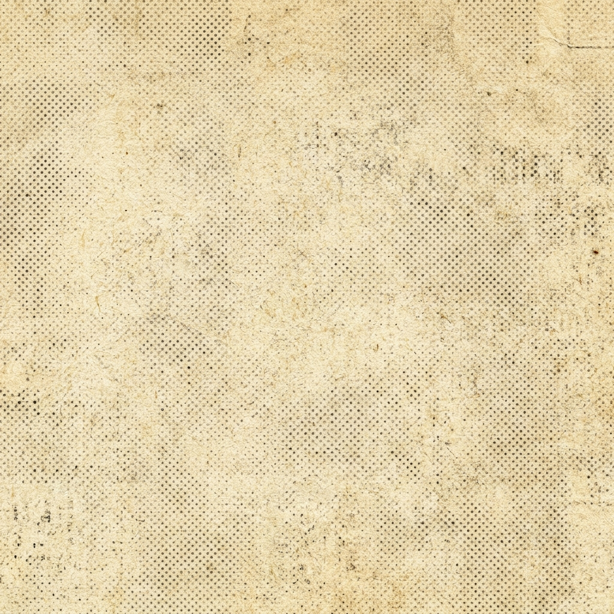

# Mundo Retrô 1950–1960 🎙️📰

> Estúdio e dossiê histórico para criação de anúncios publicitários autênticos das décadas de 1950 e 1960 para Instagram e Facebook.



## ✨ Funcionalidades

- **Cartaz Arrastável (Canvas Livre)**:
  - Upload de fotos do seu produto com rotação, escala e posicionamento livre.
  - Selos de valor e garantia em Cruzeiros (Cr$) e planos de parcelamento de época.
  - Setas publicitárias curvas dinâmicas (1910–1930), 3D Block e o clássico *Manicule* (dedo indicador).
  - Balões de texto, faixas de desconto, mascotes e ilustrações da Era de Ouro.
  - Fundos temáticos: Papel Jornal Linotipo, Sunburst Diner, Mint Green e Tela Branca.
- **Modelos de Revista (O Cruzeiro / Manchete / Madison Avenue)**:
  - Diagramações prontas para Feed (1:1), Stories/Reels (9:16) e Facebook.
  - Filtros litográficos com retícula de meio-tom (*halftone*).
  - Exportação direta em imagem PNG de alta definição.
- **Dossiê Histórico**:
  - Catálogo de tipografia, paletas cromáticas e fórmulas de redação dos anos 50 e 60.
- **System Instructions**:
  - Diretrizes para inteligências artificiais gerarem copy fiel à publicidade clássica.

## 🛠️ Tecnologias

- [React 19](https://react.dev/) + [TypeScript](https://www.typescriptlang.org/)
- [Vite](https://vitejs.dev/)
- [Tailwind CSS v4](https://tailwindcss.com/)
- [html-to-image](https://www.npmjs.com/package/html-to-image)
- [Lucide Icons](https://lucide.dev/)

## 🚀 Como rodar o projeto localmente

```bash
# 1. Clonar o repositório
git clone https://github.com/IOXeu/RetroNews.git

# 2. Entrar na pasta
cd RetroNews

# 3. Instalar dependências
npm install

# 4. Rodar o servidor de desenvolvimento
npm run dev
```

Acesse em `http://localhost:3000`.

---
Feito com paixão pela história da publicidade brasileira e mundial.
